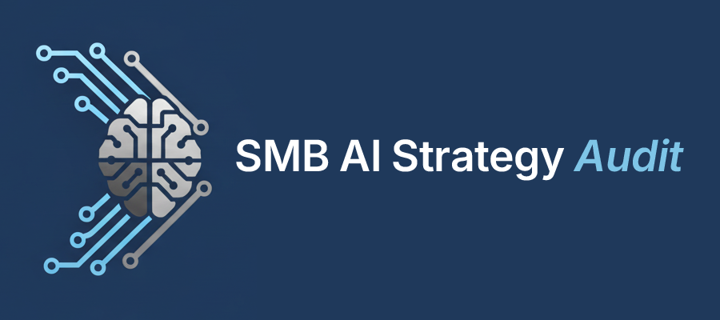

<p align="center">
  
</p>

<p align="center">
  
  
  
  
</p>

<h1 align="center">SMB AI Strategy Audit</h1>

<p align="center">
  <strong>Generate comprehensive AI strategy deliverables for any SMB company in minutes, not weeks.</strong>
</p>

<p align="center">
  <a href="#-quick-start">Quick Start</a> •
  <a href="#-features">Features</a> •
  <a href="#-how-it-works">How It Works</a> •
  <a href="#-deliverables">Deliverables</a> •
  <a href="#-installation">Installation</a> •
  <a href="#-usage">Usage</a>
</p>

---

## What Is This?

Enter a company name → Get a complete AI strategy package:

| Output | Description |
|--------|-------------|
| **8 Strategic Documents** | Tech inventory, pain points, roadmaps, maturity assessment, quick wins, ROI analysis |
| **Implementation Reports** | Detailed Word and PDF documents with recommendations |

**Cost per analysis: ~$0.15** using Perplexity + Gemini APIs

---

## Complete Beginner? Start Here

<details>
<summary><strong>Click here if you're new to coding or feeling intimidated</strong></summary>

### Don't Panic! Here's What This Actually Does

This tool is like having a consulting firm in a box. You type in a company name (like "Joe's Garage" or "your local bakery"), and it automatically:

1. **Researches** the company using AI (like having a research assistant)
2. **Writes** 8 professional strategy documents (like having a consultant)
3. **Creates** PDFs and Word docs (like having an analyst)

**That's it.** You don't need to understand the code. You just need to run it.

### What You Need (The Actual Requirements)

| What | Why | How Long to Get |
|------|-----|-----------------|
| A computer | Windows, Mac, or Linux all work | You probably have this |
| Python installed | The programming language this runs on | 5 minutes |
| Two free API keys | To use Perplexity and Gemini AI | 10 minutes |
| Claude Code (optional) | Makes everything 10x easier | 2 minutes |

### The Absolute Easiest Way (Using Claude Code)

If you have [Claude Code](https://claude.ai/code) installed, you literally just need to say:

```
Clone the repo at https://github.com/jbullockgroup/smb-ai-strategy-audit and help me set it up and run it
```

Claude Code will:
- Download all the files
- Install everything needed
- Help you get API keys
- Run the app for you

**That's the whole process if you use Claude Code.**

### Step-by-Step for Complete Beginners (Without Claude Code)

#### Step 1: Install Python (5 minutes)

**On Mac:**
1. Open Terminal (search "Terminal" in Spotlight)
2. Type: `python3 --version`
3. If you see a version number, you're done!
4. If not, go to [python.org/downloads](https://python.org/downloads) and download

**On Windows:**
1. Go to [python.org/downloads](https://python.org/downloads)
2. Download and run the installer
3. **IMPORTANT:** Check the box that says "Add Python to PATH"
4. Click Install

#### Step 2: Get Your API Keys (10 minutes)

You need two free API keys:

**Perplexity API Key:**
1. Go to [perplexity.ai](https://perplexity.ai)
2. Create an account (free)
3. Go to Settings → API
4. Click "Generate API Key"
5. Copy it somewhere safe (looks like `pplx-abc123...`)

**Gemini API Key:**
1. Go to [aistudio.google.com/apikey](https://aistudio.google.com/apikey)
2. Sign in with Google
3. Click "Create API Key"
4. Copy it somewhere safe (looks like `AIzaSy...`)

#### Step 3: Download This Project (2 minutes)

**Option A - Download ZIP (easiest):**
1. Click the green "Code" button at the top of this page
2. Click "Download ZIP"
3. Unzip the folder somewhere you can find it (like Desktop)

**Option B - Use Git:**
```bash
git clone https://github.com/jbullockgroup/smb-ai-strategy-audit.git
```

#### Step 4: Set Up the Project (3 minutes)

1. Open Terminal (Mac) or Command Prompt (Windows)

2. Navigate to the folder:
   ```bash
   cd Desktop/smb-ai-strategy-audit   # or wherever you put it
   ```

3. Run the setup:
   ```bash
   python setup.py    # On Windows
   python3 setup.py   # On Mac
   ```

4. Add your API keys:
   - Open the `.env` file in any text editor
   - Replace the placeholder text with your actual keys
   - Save the file

#### Step 5: Run It! (1 minute)

```bash
python -m strategy_factory.webapp    # Windows
python3 -m strategy_factory.webapp   # Mac
```

Your browser will open to **http://localhost:8888**

Type in any company name and click "Start Analysis"!

### Example Commands to Give Claude Code

Once you have the project set up, here are things you can ask Claude Code to do:

```
"Run an AI strategy analysis for Joe's Garage"
```

```
"Generate a comprehensive strategy report for my company [describe your company]"
```

```
"Start the web interface so I can analyze multiple companies"
```

```
"What companies have I already analyzed?"
```

```
"Help me understand the ROI calculator output for Stripe"
```

### What If Something Goes Wrong?

**"Python not found"**
- Make sure Python is installed (Step 1)
- On Windows, make sure you checked "Add Python to PATH" during install
- Try restarting your terminal/command prompt

**"API key error"**
- Double-check your `.env` file has the right keys
- Make sure there are no extra spaces
- Make sure the keys are on their own lines

**"Module not found"**
- Run `pip install -r requirements.txt` again
- Make sure you're in the right folder

**Still stuck?**
- Open an issue on GitHub
- Or ask Claude Code: "I'm getting this error: [paste error]. Help me fix it."

### You've Got This!

Seriously, the hardest part is getting the API keys. Once those are set up, it's just clicking buttons. And if you have Claude Code, it can literally do all of this for you.

</details>

---

## Quick Start

### Option 1: Claude Code (Easiest)

If you have [Claude Code](https://claude.ai/code):

```
Just say: "Clone and run the AI Strategy Factory for me"
```

### Option 2: Manual Setup

```bash
# Clone the repository
git clone https://github.com/jbullockgroup/smb-ai-strategy-audit.git
cd smb-ai-strategy-audit

# Run the setup script (works on Windows, macOS, Linux)
python setup.py

# Add your API keys to .env file
# Then run the web app
python -m strategy_factory.webapp
```

Open **http://localhost:8888** and enter a company name!

---

## Features

### Research Engine
- **Perplexity AI** for real-time company intelligence
- 13 targeted queries per analysis
- Automatic source aggregation

### Document Synthesis
- **Google Gemini 2.5 Flash** for document generation
- 8 specialized deliverable templates
- Consistent consulting-quality output

### Export Options
- Markdown documents
- Word reports (DOCX)
- PDF reports

### User Experience
- Beautiful web interface
- Real-time progress tracking
- Resume interrupted analyses
- Cross-platform support

---

## How It Works

```
┌─────────────────────────────────────────────────────────────────────┐
│                         USER INPUT                                   │
│                    "Analyze Joe's Garage"                                  │
└─────────────────────────────────────────────────────────────────────┘
                                │
                                ▼
┌─────────────────────────────────────────────────────────────────────┐
│                    PHASE 1: RESEARCH                                 │
│                                                                      │
│   Perplexity AI queries:                                            │
│   • Company overview & business model                               │
│   • Technology stack & infrastructure                               │
│   • Industry landscape & competitors                                │
│   • AI/ML current initiatives                                       │
│   • Pain points & challenges                                        │
│   • Strategic priorities                                            │
│                                                                      │
│   Output: Comprehensive research JSON                               │
└─────────────────────────────────────────────────────────────────────┘
                                │
                                ▼
┌─────────────────────────────────────────────────────────────────────┐
│                    PHASE 2: SYNTHESIS                                │
│                                                                      │
│   Google Gemini generates:                                          │
│   • 8 markdown deliverables                                        │
│   • Structured recommendations                                      │
│                                                                      │
│   Output: Strategy documents                                        │
└─────────────────────────────────────────────────────────────────────┘
                                │
                                ▼
┌─────────────────────────────────────────────────────────────────────┐
│                    PHASE 3: GENERATION                               │
│                                                                      │
│   Final outputs:                                                    │
│   • 1 PDF                                      │
│   • 1 Word documents                                               │                                        │
│                                                                      │
│   Output: Executive-ready deliverables                              │
└─────────────────────────────────────────────────────────────────────┘
```

---

## Deliverables

### Markdown Strategy Documents
| # | ID | Name | Dependencies |
|:-:|----|------|-------------|
| 1 | 01_tools_audit | **Where You Stand Today** | — |
| 2 | 02_daily_pain_points | **Where You're Losing Money** | — |
| 3 | 03_action_plan | **What To Do First** | 02 |
| 4 | 04_simple_roadmap | **Your Week-by-Week Plan** | 03 |
| 5 | 05_readiness_assessment | **Your AI Readiness** | 01, 02 |
| 6 | 06_roi_snapshot | **What It Costs & What You Save** | 03 |
| 7 | 07_closing | **Putting It All Together** | 01–06 |
| 8 | 08_executive_summary | **Executive Summary** | all above |

### Final Reports
| Type | File | Description |
|------|------|-------------|
| DOCX | AI Strategy Report | Combined strategy report (Word) |
| PDF | AI Strategy Report | Combined strategy report (PDF) |

---

## Installation

### Prerequisites

| Requirement | How to Get |
|-------------|------------|
| Python 3.9+ | [python.org](https://www.python.org/downloads/) |
| Perplexity API Key | [perplexity.ai/settings/api](https://www.perplexity.ai/settings/api) |
| Gemini API Key | [aistudio.google.com/apikey](https://aistudio.google.com/apikey) |

### Step-by-Step

```bash
# 1. Clone the repository
git clone https://github.com/jbullockgroup/smb-ai-strategy-audit.git
cd ai-strategy-factory

# 2. Create virtual environment
python3 -m venv venv

# 3. Activate it
source venv/bin/activate        # macOS/Linux
# OR
.\venv\Scripts\activate         # Windows

# 4. Install dependencies
pip install -r requirements.txt

# 5. Set up environment
cp .env.example .env
```

### Configure API Keys

Edit `.env` with your keys:

```env
PERPLEXITY_API_KEY=pplx-xxxxxxxxxxxxxxxxxxxx
GEMINI_API_KEY=AIzaSyxxxxxxxxxxxxxxxxxxxxxxxxx
```

---

## Usage

### Web Interface (Recommended)

```bash
python -m strategy_factory.webapp
```

Then open **http://localhost:8888**

### Command Line

```bash
# Quick analysis (~$0.05, 2-3 minutes)
python -m strategy_factory.main run "Joe's Garage"

# With context
python -m strategy_factory.main run "Joe's Garage" --context "Auto repair"

# Comprehensive analysis (~$0.50, 5-10 minutes)
python -m strategy_factory.main run "Joe's Garage" --mode comprehensive

# Check status
python -m strategy_factory.main status "Joe's Garage"

# Resume interrupted analysis
python -m strategy_factory.main resume "Joe's Garage"

# List all analyses
python -m strategy_factory.main list
```

---

## Project Structure

```
smb-ai-strategy-audit/
├── strategy_factory/           # Main package
│   ├── webapp.py              # Flask web application
│   ├── main.py                # CLI entry point
│   ├── config.py              # Configuration
│   ├── models.py              # Data models
│   ├── progress_tracker.py    # State management
│   │
│   ├── research/              # Phase 1: Research
│   │   ├── orchestrator.py
│   │   ├── perplexity_client.py
│   │   └── query_templates.py
│   │
│   ├── synthesis/             # Phase 2: Synthesis
│   │   ├── orchestrator.py
│   │   ├── gemini_client.py
│   │   └── prompts/           # 15 deliverable prompts
│   │
│   └── generation/            # Phase 3: Generation
│       ├── orchestrator.py
│       ├── docx_generator.py
│       └── mermaid_renderer.py
│
├── output/                    # Generated deliverables
├── docs/                      # Documentation
├── requirements.txt
├── setup.py
└── README.md
```

---

## API Costs

| API | Model | Cost | Use Case |
|-----|-------|------|----------|
| Perplexity | sonar | $0.001/1K tokens | Quick research |
| Perplexity | sonar-pro | $0.003/1K tokens | Deep research |
| Gemini | 2.5-flash | $0.075/1M input | Document synthesis |

**Typical costs:**
- **$0.15** per company


---

## Troubleshooting

<details>
<summary><strong>Port already in use</strong></summary>

The app automatically finds an available port. Or specify one:

```bash
python -m strategy_factory.webapp --port 9000
```

</details>

<details>
<summary><strong>API key errors</strong></summary>

1. Ensure `.env` file exists in project root
2. Check keys are correct (no extra spaces)
3. Verify API accounts have credits

</details>

<details>
<summary><strong>Module not found</strong></summary>

```bash
# Make sure you're in the virtual environment
source venv/bin/activate  # macOS/Linux
.\venv\Scripts\activate   # Windows

# Reinstall dependencies
pip install -r requirements.txt
```

</details>

<details>
<summary><strong>Windows-specific issues</strong></summary>

- Use PowerShell or Command Prompt (not Git Bash)
- May need to run as Administrator
- Use `python` instead of `python3`

</details>

<details>
<summary><strong>macOS-specific issues</strong></summary>

- Port 5000 is used by AirPlay Receiver (we use 8888 by default)
- Install Xcode tools: `xcode-select --install`

</details>

---

## Contributing

Contributions are welcome! See [CONTRIBUTING.md](CONTRIBUTING.md) for guidelines.

### Areas for Contribution

- [ ] Additional LLM providers (OpenAI, Anthropic)
- [ ] PDF export option
- [ ] Industry-specific templates
- [ ] Caching for repeated queries
- [ ] Batch processing multiple companies

---

## Credits

This project was based on Mark Kashef's AI Strategy Factory (https://github.com/promptadvisers/ai-strategy-factory).

## License

MIT License - see [LICENSE](LICENSE) for details.

---

## Acknowledgments

- [Perplexity AI](https://www.perplexity.ai/) - Research capabilities
- [Google Gemini](https://ai.google.dev/) - Document synthesis
- [python-docx](https://python-docx.readthedocs.io/) - Word document generation

---

<p align="center">
  <strong>Built with Claude Code</strong><br>
  <sub>The AI-powered development assistant</sub>
</p>
